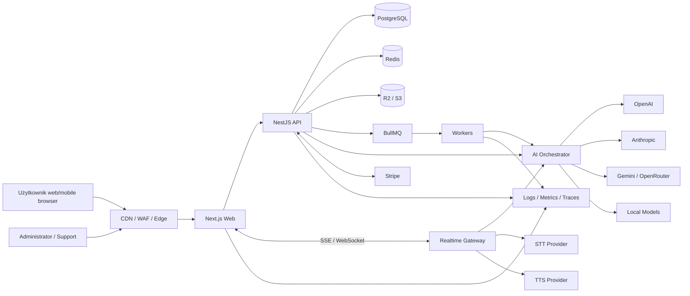
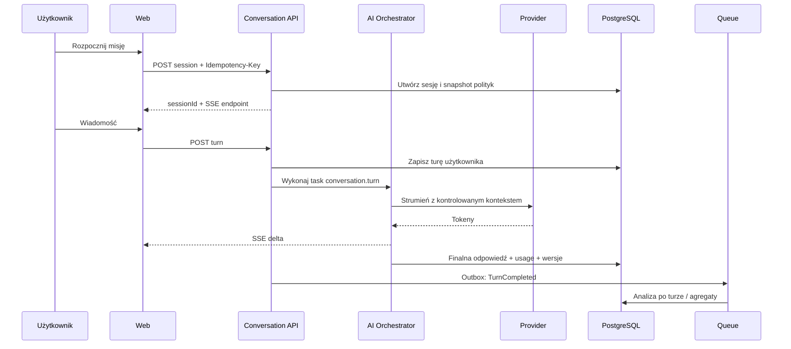
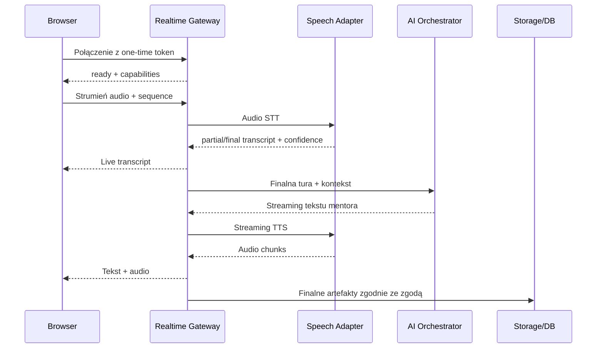

# Architektura systemu — AI English Mentor

## 1. Cel i kontekst

Dokument przekłada [analizę produktu](./PRODUCT_ANALYSIS.md) oraz [roadmapę](./ROADMAP.md) na architekturę produkcyjnego V1. System ma obsługiwać codzienny mentoring tekstowy i głosowy, adaptacyjne plany, pamięć, feedback, powtórki, płatności i administrację przy zachowaniu prywatności, przenośności między dostawcami AI oraz kontrolowanych kosztów.

Architektura jest przygotowana do wydzielenia usług, lecz V1 rozpoczyna jako **modularny monolit z osobnymi workerami**. Taki układ zapewnia silne granice domenowe i niezależne skalowanie zadań kosztownych bez operacyjnego narzutu przedwczesnych mikroserwisów.

## 2. Najważniejsze decyzje

| Obszar | Decyzja |
|---|---|
| Repozytorium | Monorepo TypeScript |
| Frontend | Next.js, React, Tailwind, shadcn/ui, React Query, React Hook Form, Zod, Framer Motion |
| Backend | NestJS jako modularny monolit, REST + SSE + WebSocket |
| Dane | PostgreSQL przez Prisma; Redis dla danych ulotnych, limitów i kolejek |
| Zadania | BullMQ z osobnymi workerami i idempotentnymi jobami |
| Pliki | Prywatny S3-compatible storage; Cloudflare R2 w produkcji |
| AI | Własna warstwa zadań i adapterów: OpenAI, Anthropic, Gemini, OpenRouter, lokalne modele |
| Głos | Wymienialne adaptery STT/TTS; audio transportowane bezpośrednio do storage lub przez kontrolowany kanał czasu rzeczywistego |
| Auth | JWT access + rotowane opaque refresh tokens w bezpiecznych cookies; OAuth/OIDC |
| Płatności | Stripe jako zewnętrzne źródło płatności, lokalne entitlements jako źródło dostępu |
| Deployment | Kontenery, niezależne web/api/worker, managed PostgreSQL/Redis/object storage |
| Kontrakty | OpenAPI + wspólne schematy Zod; zdarzenia wewnętrzne wersjonowane |

## 3. Cele jakościowe

Priorytety architektury, w kolejności:

1. Poprawność pedagogiczna i bezpieczeństwo użytkownika.
2. Prywatność, izolacja danych i audytowalność.
3. Niezawodność krytycznych ścieżek oraz możliwość degradacji.
4. Niskie odczuwalne opóźnienie rozmów.
5. Przenośność między dostawcami AI/STT/TTS.
6. Kontrola kosztu na sesję i użytkownika.
7. Szybkość bezpiecznego dostarczania zmian.
8. Skalowanie na podstawie pomiarów.

Docelowe SLO zostaną skalibrowane przed GA. Projekt przyjmuje 99,9% dostępności podstawowej aplikacji, brak utraty potwierdzonych transakcji oraz kontrolowaną degradację funkcji AI/głosu.

## 4. Widok systemu

`Realtime Gateway` jest logiczną odpowiedzialnością NestJS i może działać w tym samym artefakcie API na początku. Zostanie wydzielony procesowo, gdy profil obciążenia głosu będzie tego wymagał.

## 5. Granice domenowe

### 5.1 Identity & Access

Odpowiada za konta, logowanie, OAuth, weryfikację e-mail, 2FA, sesje, role i uprawnienia. Nie przechowuje profilu pedagogicznego. Publikuje zdarzenia tożsamości i egzekwuje polityki dostępu.

### 5.2 User Privacy & Consent

Wersjonowane zgody, preferencje retencji, eksport, usunięcie, legal hold i rejestr operacji na danych. Jest źródłem decyzji, czy treść/nagranie/pamięć może zostać zapisane lub przekazane dostawcy.

### 5.3 Learner Profile

Cele, terminy, język objaśnień, zainteresowania, preferencje mentora oraz model kompetencji. Rozróżnia dane deklarowane, obserwacje i wnioski. Każdy wniosek ma źródło, pewność, wersję algorytmu i czas ważności.

### 5.4 Learning Plan

Generuje tygodniowe i dzienne plany w granicach czasu użytkownika. Łączy cele, mastery, zaległe powtórki i reguły stabilności. AI może proponować plan, ale deterministyczne reguły zatwierdzają jego wykonalność.

### 5.5 Conversation

Cykl życia sesji, scenariusz, tury, streaming, podpowiedzi, stan misji i zakończenie. Jest właścicielem surowej historii sesji zgodnie z polityką retencji.

### 5.6 Feedback & Assessment

Rubryki, obserwacje, korekty, poziomy pewności, próbki kontrolne i wyniki. Oddziela niezmienną obserwację od zmiennej interpretacji. Nie aktualizuje mastery bezpośrednio — emituje ustrukturyzowane obserwacje.

### 5.7 Learning Engine

Taksonomia błędów, mastery, frazy, retencja i spaced repetition. Konsumuje obserwacje, aktualizuje stan kompetencji oraz generuje kandydatów do planu.

### 5.8 Speech

Nagrania, zgody, transkrypcje, segmenty czasowe, ocena jakości sygnału, STT/TTS i metryki wymowy. Nie przedstawia błędu STT jako błędu językowego.

### 5.9 AI Platform

Katalog zadań, prompty, routing, adaptery, polityki danych, walidacja, koszt, retry, fallback i ewaluacje. Domena nie zna szczegółów interfejsu użytkownika.

### 5.10 Billing & Entitlements

Klienci Stripe, subskrypcje, webhooki, kupony, okresy karencji, limity i prawa dostępu. Stripe jest źródłem płatności; lokalny ledger zdarzeń i entitlements zapewniają spójne decyzje produktu.

### 5.11 Gamification

XP, streak, misje i osiągnięcia. Konsumuje zweryfikowane zdarzenia nauki i nie może samodzielnie potwierdzać ukończenia wartościowej aktywności.

### 5.12 Administration & Moderation

Operacje supportu, prompt management, feature flags, moderacja, audyt i konfiguracja scenariuszy. Dostęp do treści wymaga jawnego celu, roli i zapisu audytowego.

### 5.13 Notifications

E-mail i późniejsze kanały. Dostaje minimalny payload, respektuje strefę czasową, preferencje i ograniczenia częstotliwości.

### 5.14 Analytics

Zdarzenia produktowe bez domyślnego kopiowania treści rozmów. Dane analityczne są pseudonimizowane i oddzielone od operacyjnego źródła prawdy.

## 6. Reguły zależności

- Moduły komunikują się przez publiczne serwisy aplikacyjne albo wersjonowane zdarzenia; nie importują prywatnych repozytoriów innej domeny.
- Domena nie zależy od NestJS, Prisma, konkretnego modelu AI ani Stripe.
- Adaptery infrastruktury zależą od portów zdefiniowanych w warstwie aplikacji/domeny.
- Operacje między modułami w jednym żądaniu używają jawnej orkiestracji; przepływy długie i kosztowne używają zdarzeń.
- Bezpośrednie zapytania do tabel innego modułu są zabronione poza kontrolowanymi read models.
- Identyfikatory domenowe są nieprzewidywalne (UUIDv7/ULID) i nie niosą PII.

## 7. Warstwy aplikacji backendowej

Każdy moduł ma cztery logiczne warstwy:

1. **Domain:** encje, value objects, polityki i zdarzenia domenowe.
2. **Application:** use cases, porty, transakcje, autoryzacja kontekstowa i orkiestracja.
3. **Infrastructure:** Prisma, Redis, BullMQ, providerzy, storage i transport e-mail.
4. **Interface:** kontrolery REST, gatewaye realtime, konsumenci webhooków i jobów.

CQRS jest stosowane selektywnie: osobne read models dla dashboardu, administracji i raportów, ale bez pełnego event sourcingu. PostgreSQL pozostaje źródłem prawdy.

## 8. Frontend

### 8.1 Podział odpowiedzialności

- Next.js App Router obsługuje routing, SSR publicznych stron, metadata i bezpieczny shell.
- React Server Components dla treści publicznych i odczytów niewymagających bogatej interakcji.
- Client Components dla rozmowy, audio, formularzy, wykresów i optymistycznych interakcji.
- React Query zarządza stanem serwerowym, cache, anulowaniem i invalidacją.
- React Hook Form + Zod obsługują dostępne formularze i wspólną walidację.
- Lokalny stan UI pozostaje lokalny; brak globalnego magazynu bez konkretnej potrzeby.

### 8.2 Granice tras

- `(marketing)` — publiczne SSR/SSG, SEO i strony prawne.
- `(auth)` — logowanie, rejestracja, odzyskiwanie i callbacki.
- `(app)` — chroniona aplikacja użytkownika.
- `(admin)` — osobny shell, polityki RBAC i dodatkowe zabezpieczenia.

### 8.3 Komunikacja

- REST dla komend i zwykłych odczytów.
- SSE dla jednokierunkowego streamingu tekstu i postępu analiz.
- WebSocket dla dwukierunkowej rozmowy głosowej i sygnałów realtime.
- Bezpośredni upload do storage przez krótkotrwały presigned URL; API finalizuje i weryfikuje obiekt.

### 8.4 Odporność UX

- Każda długa operacja ma identyfikator, status i możliwość bezpiecznego ponowienia.
- Niedokończona rozmowa jest lokalnie checkpointowana bez przechowywania wrażliwej treści ponad konieczność.
- Error boundaries są izolowane per obszar; awaria rekomendacji nie blokuje dashboardu.
- Voice degraduje do tekstu, a brak analizy wymowy nie unieważnia ukończonej rozmowy.

## 9. API i kontrakty

### 9.1 REST

- Prefiks `/api/v1`; zmiany addytywne nie wymagają nowej wersji.
- JSON zgodny z jawnie generowanym OpenAPI.
- Błędy w jednolitym formacie Problem Details z bezpiecznym kodem, correlation ID i polami walidacji.
- Cursor pagination dla strumieni zdarzeń/historii; offset tylko dla małych paneli administracyjnych.
- `Idempotency-Key` dla tworzenia sesji, operacji kosztowych, uploadów i płatności.
- ETag/wersja rekordu dla konfliktów optymistycznych.

### 9.2 SSE

Strumień emituje wersjonowane zdarzenia: `started`, `delta`, `tool_status`, `completed`, `failed`, `heartbeat`. Klient wysyła `Last-Event-ID`, a serwer potrafi odtworzyć ograniczone okno bufora z Redis. Finalny wynik jest utrwalany transakcyjnie i dostępny przez REST.

### 9.3 WebSocket

- Krótkotrwały, jednorazowy token połączenia powiązany z użytkownikiem i sesją.
- Jawna maszyna stanów: connecting → ready → listening → processing → speaking → ended.
- Sekwencje ramek, acknowledgements, backpressure i limity rozmiaru.
- Binarny transport audio; tekstowe komunikaty sterujące walidowane schematem.
- Heartbeat, timeout bezczynności i kontrolowane wznowienie.

### 9.4 Zdarzenia wewnętrzne

Format zawiera `eventId`, `eventType`, `schemaVersion`, `occurredAt`, `actorId`, `aggregateId`, `correlationId`, `causationId` i minimalny payload. Publikacja używa transactional outbox; konsumenci są idempotentni przez inbox/deduplication.

## 10. Kluczowe przepływy

### 10.1 Sesja tekstowa

Kontekst jest składany z: polityki produktu, wersji scenariusza, celu sesji, ograniczonego okna rozmowy, zatwierdzonych wspomnień i trafnych elementów profilu. Pełny profil nigdy nie jest automatycznie dołączany.

### 10.2 Zakończenie i feedback

1. API atomowo oznacza sesję jako kończoną i publikuje `SessionFinalizationRequested`.
2. Worker buduje zredagowany materiał i uruchamia ustrukturyzowane zadania oceny.
3. Walidator sprawdza odniesienia korekt do źródłowej wypowiedzi, rubrykę i pewność.
4. Feedback trafia do bazy, a obserwacje do outboxa.
5. Learning Engine aktualizuje błędy/mastery i tworzy kandydatów powtórek.
6. Plan jest przeliczany przy następnym odczycie lub przez job debounce.
7. Klient śledzi status przez SSE/polling i wyświetla wynik dopiero po finalizacji.

### 10.3 Sesja głosowa

Surowe audio może być przetwarzane strumieniowo bez trwałego zapisu. Jeśli użytkownik zezwala na analizę po sesji, szyfrowany obiekt otrzymuje krótki TTL i jest usuwany po zakończeniu procesu zgodnie z polityką.

### 10.4 Webhook Stripe

1. Surowe body jest weryfikowane podpisem przed parsowaniem biznesowym.
2. Event ID jest zapisywany w inbox; duplikat zwraca sukces bez powtórzenia skutku.
3. Payload jest zapisany w minimalnym, zaszyfrowanym zakresie audytowym.
4. Worker porządkuje stan na podstawie Stripe API, nie zakłada kolejności eventów.
5. Transakcja aktualizuje subscription mirror, ledger i entitlements.
6. Zdarzenie domenowe odświeża cache uprawnień i analitykę.

## 11. Strategia danych

### 11.1 PostgreSQL

Jedna logiczna baza V1, osobny schemat lub prefiksy tabel per moduł oraz oddzielny użytkownik migracyjny. Krytyczne tabele zawierają `createdAt`, `updatedAt`, wersję optymistyczną i — gdzie potrzebne — `deletedAt`.

Transakcje obejmują wyłącznie spójność lokalnego use case. Długie przepływy stosują sagi/process managers i kompensacje. Brak rozproszonych transakcji z dostawcami.

### 11.2 Redis

- cache krótkotrwałych read models,
- distributed rate limits i budżety kosztowe,
- sesje realtime i bufory SSE,
- locks o krótkim TTL wyłącznie tam, gdzie baza nie wystarcza,
- BullMQ.

Redis nie jest źródłem prawdy dla płatności, postępu, zgód ani treści sesji.

### 11.3 Object storage

- Prywatne buckety i zablokowany dostęp publiczny.
- Osobne prefiksy/klucze dla audio, eksportów i artefaktów administracyjnych.
- Presigned URLs z krótkim TTL, ograniczeniem typu i rozmiaru.
- Weryfikacja MIME po treści, skanowanie, checksum i status kwarantanny.
- Lifecycle policies usuwające pliki zgodnie z klasą retencji.

### 11.4 Retencja

Polityka jest konfigurowana per klasa danych, jurysdykcję i zgodę. Usunięcie użytkownika uruchamia proces z manifestem, idempotencją i raportem. Backupy wygasają zgodnie z harmonogramem; usunięte rekordy nie wracają do aktywnego systemu po restore dzięki tombstone ledger.

### 11.5 Analityka

Na początku wersjonowane zdarzenia trafiają przez outbox do kontrolowanego pipeline'u. Identyfikatory są pseudonimizowane, a treść rozmów wyłączona. Hurtownia/analityczny storage zostanie wybrany po poznaniu wolumenu; produkt nie wykonuje ciężkich analiz na bazie transakcyjnej.

## 12. AI Platform

### 12.1 Kontrakt zadania

Każde zadanie AI definiuje:

- `taskType` i wersję,
- schemat wejścia i wyjścia,
- klasę danych oraz dozwolonych dostawców/regiony,
- wymagane capabilities (streaming, JSON schema, audio, tools),
- limity latency, kosztu i tokenów,
- temperaturę/strategię deterministyczności,
- zasady retry/fallback,
- ewaluacje i progi publikacji.

Kod domenowy wywołuje zadanie, nigdy nazwę modelu.

### 12.2 Adapter dostawcy

Wspólny interfejs obejmuje `generate`, `stream`, `transcribe`, `synthesize`, `embed` (jeśli używane), `moderate`, `health` i raport użycia. Adapter normalizuje błędy, usage, finish reason, identyfikatory i możliwości, ale nie ukrywa różnic semantycznych — capability registry zapobiega niezgodnemu routingowi.

### 12.3 Routing

Router bierze pod uwagę klasę zadania, politykę prywatności, region, jakość z ewaluacji, p95 latency, cenę, bieżący health i budżet użytkownika. Konfiguracja jest wersjonowana. Fallback zachodzi tylko między zatwierdzonymi modelami tej samej klasy; model awaryjny nie otrzymuje danych, których jego polityka nie dopuszcza.

### 12.4 Prompty

- System prompts są szablonami wersjonowanymi, recenzowanymi i testowanymi.
- Dane użytkownika są serializowane jako delimitowane dane, nie instrukcje.
- Output używa JSON Schema/Zod tam, gdzie wynik zasila logikę.
- Wersja promptu, modelu, routera i rubryki jest zapisywana przy wyniku.
- Rollout: offline eval → shadow → canary → production; możliwy natychmiastowy rollback.

### 12.5 Pamięć

Pamięć dzieli się na:

- roboczą sesji,
- zatwierdzone fakty użytkownika,
- wnioski z poziomem pewności i wygaśnięciem,
- zdarzenia edukacyjne i mastery,
- streszczenia historii.

Retrieval jest filtrowany po właścicielu, celu zadania, zgodzie, ważności i minimalnej trafności. Pamięć nie może przechowywać sekretów, danych szczególnie wrażliwych ani niepotwierdzonych diagnoz. Użytkownik ma podgląd, korektę i usunięcie.

### 12.6 Walidacja i ewaluacja

- Walidacja struktury oraz cytowanych fragmentów przed zapisem.
- Reguły deterministyczne dla zakresu korekty i poziomu.
- Golden sety ekspertów oraz slice'y dla CEFR, akcentu i języka ojczystego.
- Metryki poprawności, stabilności, usefulness, safety, latency i kosztu.
- Human review próbek, disagreement queue i zgłoszenia użytkownika.
- AI judge może wspierać triage, ale nie jest jedynym arbitrem jakości.

## 13. Learning Engine

Silnik stosuje hybrydę reguł deterministycznych i ustrukturyzowanych obserwacji AI.

- Każda obserwacja zawiera skill, dowód, wagę, pewność i kontekst.
- Mastery aktualizuje się dopiero po walidacji obserwacji; pojedynczy wynik ma ograniczony wpływ.
- Spaced repetition korzysta z jawnego algorytmu (początkowo FSRS lub równoważny, skalibrowany na własnych danych).
- Priorytet planu łączy due date, wagę celu, trudność, świeżość, zmęczenie i dostępny czas.
- Reguły stabilności ograniczają dzienną zmianę planu.
- Wersjonowanie algorytmu umożliwia przeliczenie i porównanie cohort bez nadpisania historii.

## 14. Bezpieczeństwo

### 14.1 Granice zaufania

Niezaufane są: przeglądarka, pliki, treść użytkownika, odpowiedź modelu, webhook przed weryfikacją oraz dane z integracji. Każda granica ma walidację, uwierzytelnienie, autoryzację i limity.

### 14.2 Uwierzytelnienie i sesje

- Hasła: Argon2id z parametrami kalibrowanymi i ochrona haseł skompromitowanych.
- Access JWT o krótkim TTL, minimalnych claims i rotowanych kluczach asymetrycznych.
- Refresh token jest losowy, hashowany w bazie, rotowany przy użyciu i wysyłany tylko w `HttpOnly; Secure; SameSite` cookie.
- Wykrycie reuse unieważnia rodzinę tokenów.
- OAuth używa Authorization Code + PKCE, state i nonce; konta nie są automatycznie łączone na podstawie niezweryfikowanego e-maila.
- TOTP 2FA z jednorazowymi recovery codes przechowywanymi w formie hashy.

### 14.3 Autoryzacja

RBAC zapewnia role bazowe, a polityki zasobowe sprawdzają właściciela, organizację, cel i stan. Admin UI nie stanowi granicy bezpieczeństwa; każde API egzekwuje uprawnienia. Uprzywilejowane operacje mogą wymagać step-up authentication.

### 14.4 Ochrona aplikacji

- WAF, rate limit warstwowy, bot protection i limity kosztowe.
- CSRF dla operacji korzystających z cookies; restrykcyjny CORS allowlist.
- Helmet/CSP z nonce, HSTS, frame-ancestors i bezpieczna polityka referrer.
- React escaping plus sanitizacja dopuszczonego rich text; brak wykonywania HTML modelu.
- Prisma z parametryzacją; raw SQL tylko w audytowanych adapterach.
- SSRF: allowlist dostawców, egress controls i brak pobierania dowolnych URL użytkownika.
- Skan zależności, obrazów, IaC, sekretów i SBOM w CI.

### 14.5 Ochrona AI

- Prompt injection traktowany jak niezaufana treść, nie komenda.
- Modele nie otrzymują narzędzi administracyjnych ani bezpośredniego dostępu do bazy.
- Tool calls mają allowlist, walidację, osobną autoryzację i limity.
- DLP/redakcja przed wysłaniem danych oraz kontrola odpowiedzi.
- Moderacja jest warstwowa i nie blokuje bezpiecznych ćwiczeń językowych bez powodu.

### 14.6 Sekrety i szyfrowanie

- Sekrety tylko w secret managerze, nigdy w repozytorium ani obrazie.
- TLS wszędzie; szyfrowanie dysków/bazy/storage oraz envelope encryption dla pól szczególnie wrażliwych.
- Osobne klucze/role per środowisko, rotacja i audyt użycia.
- Logi zabraniają tokenów, haseł, pełnych promptów, audio i danych płatniczych.

## 15. Prywatność i zgodność

- Rejestr operacji przetwarzania i umowy DPA z dostawcami.
- Data residency steruje routingiem przed wywołaniem modelu/storage.
- Zgoda jest sprawdzana w use case i ponownie w workerze, bo mogła zostać wycofana.
- Purpose limitation: dane z nauki nie są automatycznie używane do marketingu lub treningu.
- DSAR jest procesem śledzonym, idempotentnym i audytowanym.
- Dane płatnicze pozostają w Stripe; system przechowuje tylko potrzebne identyfikatory i metadane.
- Przed GA wymagane są DPIA/ocena prawna dla regionów wdrożenia, szczególnie nagrań i profilowania.

## 16. Kolejki i przetwarzanie asynchroniczne

Oddzielne kolejki dla: feedbacku, learning events, planów, speech analysis, TTS, powiadomień, webhooków, eksportów/usunięć i agregacji analitycznej.

Każdy job ma:

- stabilny business key i idempotency key,
- wersjonowany payload z identyfikatorem rekordu, nie nadmiarem PII,
- limit prób, exponential backoff z jitter,
- timeout i heartbeat,
- klasyfikację błędów retryable/non-retryable,
- dead-letter flow z alertem i narzędziem bezpiecznego replay,
- trace/correlation ID i metrykę kosztu.

Joby AI rezerwują budżet przed wywołaniem i rozliczają faktyczne usage po zakończeniu. Osierocone rezerwacje wygasają.

## 17. Cache i spójność

- Cache-aside dla dashboardu, scenariuszy i konfiguracji publicznej.
- Entitlements mają krótki cache i event-driven invalidation; w niejasnym stanie system wybiera bezpieczne, udokumentowane zachowanie.
- Klucze zawierają tenant/user, wersję schematu i zasobu.
- Brak cache'owania pełnych promptów/odpowiedzi zawierających PII bez szyfrowania i uzasadnienia.
- Mutacje zapisują źródło prawdy, publikują outbox, a następnie invalidują read models.
- Stale-while-revalidate jest dozwolone dla rekomendacji, nie dla zgód, uprawnień i płatności.

## 18. Skalowanie i wydajność

### 18.1 Strategia skalowania

- Web, API i workery są bezstanowe i skalowane niezależnie.
- Workery dzielą się według profilu CPU/I/O/GPU oraz priorytetu.
- Realtime gateway stosuje shared state w Redis; sticky sessions tylko jeśli wymaga ich transport.
- Connection pooling z kontrolą limitów PostgreSQL.
- Indeksy wynikają z rzeczywistych zapytań; explain plans są przeglądane dla gorących ścieżek.
- Read replicas dopiero po pomiarze; nie obsługują odczytów wymagających read-after-write.
- Multi-region dopiero po osiągnięciu skali uzasadniającej złożoność; wcześniej CDN i regionalny compute blisko bazy/dostawców.

### 18.2 Budżety wydajności

- Web: budżet JS per route, optymalizacja obrazów/fontów i brak ciężkich bibliotek w shellu.
- API: p95/p99 per endpoint, limity czasu DB i liczby zapytań.
- AI: czas do pierwszego tokenu, całkowita tura, throughput i timeout per task.
- Głos: czas partial STT, end-of-turn, start TTS i jitter.
- Kolejki: age of oldest job, wait time, processing time i failure rate.

## 19. Niezawodność i degradacja

| Awaria | Zachowanie |
|---|---|
| Główny LLM niedostępny | Circuit breaker, zatwierdzony fallback lub czytelne retry |
| STT niedostępne | Sesja tekstowa; zachowanie niesfinalizowanego audio zgodnie z zgodą |
| TTS niedostępne | Tekst mentora i opcjonalne późniejsze audio |
| Redis niedostępny | Funkcje zależne fail closed/controlled; trwałe dane pozostają w PostgreSQL |
| Worker backlog | Priorytety, autoscaling, informacja o opóźnionej analizie |
| Stripe niedostępny | Zachowanie istniejących uprawnień w okresie tolerancji; brak utraty eventów |
| Object storage niedostępny | Brak nowego uploadu, rozmowa tekstowa nadal działa |
| Provider zwraca zły format | Walidacja, ograniczona naprawa, retry/fallback, brak zapisu sfabrykowanego wyniku |

Circuit breakers, bulkheads i concurrency limits chronią przed kaskadową awarią i niekontrolowanym kosztem.

## 20. Observability

### 20.1 Telemetria

- OpenTelemetry trace od przeglądarki/API przez worker do dostawcy (bez treści).
- Strukturalne logi z correlation ID, kategorią błędu i redakcją.
- Metryki RED dla usług, USE dla infrastruktury oraz metryki domenowe.
- AI: task/model/prompt version, latency, usage, koszt, fallback i validation outcome.
- Learning: ukończenia, retry po korekcie, retencja i mastery bez kopiowania treści.

### 20.2 Alerty

Alerty opierają się na symptomach użytkownika i SLO: error budget burn, brak możliwości logowania, utrata streamu, backlog, webhook lag, wzrost kosztu i spadek jakości. Każdy alert ma właściciela, severity, runbook i kanał eskalacji.

### 20.3 Audyt

Audit log jest append-only, zawiera aktora, cel, zasób, akcję, wynik, uzasadnienie i metadane sesji. Treść wrażliwa nie jest payloadem audytu. Retencja i dostęp są odrębne od zwykłych logów.

## 21. Deployment i środowiska

### 21.1 Artefakty

- `web`: Next.js.
- `api`: NestJS REST/SSE/WebSocket.
- `worker`: ten sam kod domenowy, różne profile kolejek.
- `migration`: jednorazowy, wersjonowany job.

Obrazy są minimalne, nie-root, podpisane, skanowane i identyfikowane przez digest. Build jest powtarzalny i generuje SBOM.

### 21.2 Środowiska

- Local: Docker Compose z bezpiecznymi atrapami dostawców i opcjonalnymi sandboxami.
- Preview: izolowane wdrożenie dla zmian bez danych produkcyjnych.
- Test/Staging: konfiguracja zbliżona do produkcji, syntetyczne dane i sandbox Stripe.
- Production: oddzielne konto/projekt, sieci, klucze i polityki dostępu.

### 21.3 CI/CD

Pipeline: format/lint → typy → unit → contract/integration → build/SBOM → skany → E2E → AI eval gate → deploy staging → smoke → approval/canary → production verification.

Migracje używają expand/contract. Wdrożenie kodu nie zakłada natychmiastowego usunięcia starej kolumny. Feature flags oddzielają deployment od release.

## 22. Backup i disaster recovery

- Automatyczne backupy PostgreSQL z PITR oraz kopie w odseparowanym koncie/regionie zgodnie z analizą ryzyka.
- Versioning/lifecycle dla potrzebnych obiektów, bez obchodzenia żądań usunięcia.
- Redis jest odtwarzalny; nie jest jedynym miejscem trwałych danych.
- Udokumentowane RPO/RTO per klasa: konto/płatności, nauka, audio, analityka.
- Kwartalne testy restore, okresowe ćwiczenia utraty regionu/dostawcy i raport działań.
- Tombstone ledger zapobiega przywróceniu usuniętych danych do aktywnego systemu.

## 23. Testowalność architektury

- Porty dostawców umożliwiają deterministyczne fake'i w testach bez sieci.
- Contract test suite jest obowiązkowa dla każdego adaptera AI/STT/TTS.
- Testcontainers lub odpowiednik dla PostgreSQL, Redis i storage.
- Zegar, generator ID i randomness są wstrzykiwane do domeny.
- Golden fixtures są wersjonowane i pozbawione danych osobowych.
- E2E korzysta z testowych providerów; osobny pipeline wykonuje ograniczone testy prawdziwych dostawców.
- Chaos tests obejmują timeout, duplikat eventu, out-of-order webhook, przerwany stream i niedostępność zależności.

## 24. Strategia ewolucji

Moduł może zostać wydzielony w usługę, gdy ma niezależny profil skalowania, wymagania bezpieczeństwa lub tempo zmian, a obserwowalność pokazuje realną potrzebę. Pierwsi kandydaci: Realtime Speech, AI Runtime oraz Analytics ingestion.

Warunki wydzielenia:

- stabilny kontrakt i właściciel domeny,
- brak współdzielonych transakcji wymagających natychmiastowej spójności,
- własny store lub jasno określona własność danych,
- contract tests, SLO, runbook i plan migracji,
- korzyść większa niż koszt sieci, deploymentu i operacji.

## 25. Architecture Decision Records

### ADR-001: Modularny monolit zamiast mikroserwisów

**Decyzja:** NestJS z twardymi modułami i osobnymi workerami.  
**Powód:** spójne transakcje i szybka iteracja V1 przy zachowaniu ścieżki wydzielenia.  
**Konsekwencja:** potrzebne automatyczne testy granic importów i dyscyplina własności danych.

### ADR-002: PostgreSQL jako źródło prawdy

**Decyzja:** trwały stan biznesowy pozostaje w PostgreSQL.  
**Powód:** transakcje, integralność i prostota operacyjna.  
**Konsekwencja:** Redis i read models są odtwarzalne.

### ADR-003: Transactional outbox/inbox

**Decyzja:** zdarzenia są publikowane przez outbox, konsumenci deduplikują przez inbox.  
**Powód:** brak utraty zdarzeń między transakcją a kolejką.  
**Konsekwencja:** eventual consistency i konieczność monitorowania lag.

### ADR-004: REST + SSE + WebSocket

**Decyzja:** dobrać transport do charakteru interakcji.  
**Powód:** REST upraszcza operacje, SSE tekst, WebSocket dwukierunkowy głos.  
**Konsekwencja:** wspólne zasady auth, resume i obserwowalności dla trzech transportów.

### ADR-005: Warstwa zadań AI zamiast bezpośrednich SDK

**Decyzja:** domena wywołuje wersjonowane taski, a platforma dobiera provider/model.  
**Powód:** przenośność, kontrola danych, kosztu i ewaluacji.  
**Konsekwencja:** trzeba utrzymywać capability registry oraz testy kontraktowe.

### ADR-006: Pamięć jawna i kontrolowana

**Decyzja:** pamięć ma typ, źródło, pewność, zgodę, TTL i interfejs zarządzania.  
**Powód:** zaufanie i unikanie niekontrolowanego profilu.  
**Konsekwencja:** retrieval jest bardziej złożony, ale audytowalny.

### ADR-007: Brak pełnego event sourcingu

**Decyzja:** klasyczne modele transakcyjne plus append-only obserwacje/audyt tam, gdzie potrzebne.  
**Powód:** pełny event sourcing nie daje V1 proporcjonalnej korzyści.  
**Konsekwencja:** historia krytycznych zmian musi być projektowana explicite.

### ADR-008: Lokalne entitlements

**Decyzja:** Stripe reprezentuje płatność, lokalny moduł reprezentuje prawa produktu.  
**Powód:** odporność, szybkość i jedno miejsce egzekwowania limitów.  
**Konsekwencja:** wymagane reconciliation i poprawna obsługa webhooków.

### ADR-009: Asynchroniczny feedback końcowy

**Decyzja:** rozmowa jest realtime, pełna ocena po sesji trafia do workerów.  
**Powód:** niższe opóźnienie i możliwość dokładniejszych modeli.  
**Konsekwencja:** UX pokazuje postęp i bezpiecznie wznawia oczekiwanie.

### ADR-010: Treści użytkownika poza analityką

**Decyzja:** telemetryczny pipeline otrzymuje zdarzenia i metadane, nie surowe rozmowy.  
**Powód:** minimalizacja danych i ograniczenie skutków naruszenia.  
**Konsekwencja:** analizy jakości treści odbywają się w kontrolowanym, osobnym procesie.

## 26. Otwarte decyzje do zamknięcia przed implementacją

Nie zmieniają granic architektury, ale wymagają spike'ów/benchmarków:

1. Dostawca hostingu i regiony na podstawie rynku startowego oraz DPA.
2. Providerzy STT/TTS po benchmarku opóźnienia, akcentów, timestamps, kosztu i retencji.
3. Pierwsze zatwierdzone modele per task po golden evals.
4. Konkretne RPO/RTO oraz okresy retencji po konsultacji prawnej i kosztowej.
5. Narzędzia observability/feature flags/analytics według budżetu i wymagań residency.
6. Algorytm powtórek po eksperymencie FSRS i baseline.
7. Transport audio (chunked WebSocket/WebRTC) po pomiarze przeglądarek i dostawców; kontrakt domeny pozostaje niezależny.

Każda decyzja zostanie zapisana jako ADR z kontekstem, alternatywami, wynikiem benchmarku i konsekwencjami.

## 27. Kryteria ukończenia etapu architektury

Etap jest ukończony, gdy:

- wyznaczono granice domen i reguły zależności,
- opisano komponenty web, API, realtime, workerów, danych i integracji,
- zdefiniowano przepływy rozmowy, feedbacku, głosu i płatności,
- określono multi-provider AI, pamięć, routing, ewaluacje i kontrolę kosztów,
- uwzględniono bezpieczeństwo, prywatność, niezawodność, skalowanie i DR,
- ustalono strategię kontraktów, zdarzeń, cache, kolejek i wdrożeń,
- zapisano kluczowe ADR-y i jawne otwarte decyzje,
- można zaprojektować strukturę katalogów bez zmiany odpowiedzialności modułów.

## 28. Następny etap

Następnym etapem jest docelowa struktura katalogów monorepo wraz z zasadami importów, nazewnictwa, własności modułów, lokalizacji testów, kontraktów, migracji, infrastruktury i dokumentacji. Nie będzie jeszcze implementacją funkcji biznesowych; ma stworzyć jednoznaczny szkielet dla schematu bazy danych i kolejnych etapów.
