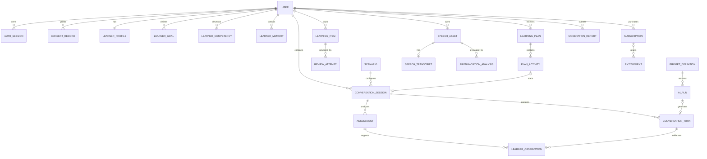

# Model danych — AI English Mentor

## 1. Artefakty

- Produkcyjny schemat Prisma: [`apps/api/prisma/schema.prisma`](./apps/api/prisma/schema.prisma)
- Silnik: PostgreSQL.
- Źródło prawdy: baza transakcyjna; Redis, kolejki i read models są odtwarzalne.

Schemat obejmuje V1: tożsamość, zgody, profil uczącego się, pamięć, rozmowy, oceny, Learning Engine, plany, głos, AI Platform, moderację, płatności Stripe/Google Play, urządzenia Android, powiadomienia, gamifikację, audyt, outbox/inbox i idempotencję.

## 2. Zasady projektowe

- UUID jako nieprzewidywalne identyfikatory; docelowo aplikacja może generować UUIDv7 bez zmiany typu kolumny.
- Nazwy w Prisma są domenowe, fizyczne nazwy PostgreSQL używają `snake_case` przez `@map`/`@@map`.
- Czas biznesowy jest zapisywany jako `timestamptz`; dzień planu/streak jako `date` oraz strefa użytkownika w profilu.
- Kwoty kosztów są liczbą całkowitą w mikrounits, nigdy `float`.
- Wyniki i pewność używają `Decimal` z ograniczoną precyzją.
- JSON przechowuje wersjonowane snapshoty/konfiguracje, nie zastępuje relacji wymaganych do integralności.
- Treść użytkownika, pamięć, purchase token i payloady wrażliwe są szyfrowane na poziomie aplikacji przez envelope encryption.
- Modele mają indeksy dla ścieżek użytkownika, kolejek, retencji i operacji administracyjnych.
- Usunięcie danych jest procesem domenowym, nie bezrefleksyjnym `DELETE user`.

## 3. Granice własności danych

| Domena | Tabele główne |
|---|---|
| Identity | users, auth_identities, auth_sessions, user_roles, one_time_tokens, totp_credentials, recovery_codes |
| Privacy | consent_records, privacy_requests, data_tombstones |
| Learner Profile | learner_profiles, learner_goals, learner_competencies, learner_memories |
| Conversation | scenarios, conversation_sessions, conversation_turns |
| Assessment | assessments, learner_observations |
| Learning Engine | learning_items, review_attempts |
| Learning Plan | learning_plans, plan_activities |
| Speech | speech_assets, speech_transcripts, pronunciation_analyses |
| AI Platform | prompt_definitions, ai_runs, usage_ledger |
| Moderation | moderation_reports |
| Billing | subscriptions, entitlements, billing_events |
| Mobile/Notifications | user_devices, notifications |
| Gamification | user_streaks, xp_ledger |
| Platform | audit_logs, outbox_events, inbox_messages, idempotency_records |

Inny moduł nie odczytuje tabel bezpośrednio. Korzysta z publicznego use case, zdarzenia integracyjnego lub zatwierdzonego read modelu.

## 4. ERD wysokiego poziomu

## 5. Tożsamość i dostęp

- `users.email_normalized` jest unikalny, ale nullable dla kont zanonimizowanych/usuniętych.
- Hasła są przechowywane wyłącznie jako Argon2id hash.
- `auth_identities` wymusza unikalność `(provider, provider_user_id)`.
- Refresh token jest przechowywany jako hash; `token_family_id` służy wykrywaniu reuse.
- Tokeny jednorazowe są hashowane, mają cel, TTL i `consumed_at`.
- TOTP secret jest szyfrowany, recovery codes hashowane.
- Role są wielowartościowe; ich zmiany trafiają do audit log.

Produkcja powinna dodać częściowy indeks unikalny na aktywny adres e-mail, jeżeli wymagania anonimizacji wymuszą przechowywanie historycznego hasha; Prisma nie opisuje wszystkich partial indexes, więc trafia on do ręcznie kontrolowanej migracji SQL.

## 6. Zgody, prywatność i usunięcie konta

`consent_records` jest append-only. Aktualny stan wynika z najnowszego rekordu danego typu/polityki; historia nie jest nadpisywana.

`privacy_requests` prowadzi cały proces eksportu/usunięcia. `manifest` zawiera statusy podsystemów, ale nie kopiuje treści. Usunięcie:

1. wymaga ponownego uwierzytelnienia lub jednorazowej weryfikacji,
2. natychmiast blokuje nowe przetwarzanie i unieważnia sesje,
3. usuwa lub anonimizuje dane domen w jobach idempotentnych,
4. usuwa obiekty storage i dane podprocesorów,
5. zachowuje minimalne rekordy finansowe/audytowe wymagane prawem bez możliwości ponownego profilowania,
6. tworzy `data_tombstones` z jednokierunkowym hashem, aby restore backupu nie reaktywował danych,
7. kończy się raportem manifestu i potwierdzeniem użytkownika.

Relacja `Subscription → User` używa `Restrict`, ponieważ rozliczenia mogą wymagać retencji. Proces usuwa dane identyfikujące z aktywnego profilu i pseudonimizuje wymagane rekordy zamiast wykonywać prostą kaskadę.

## 7. Model uczącego się i pamięć

- `learner_profiles` zawiera dane deklarowane oraz ustawienia.
- `learner_competencies` przechowuje bieżącą projekcję; historia dowodów pozostaje w `learner_observations`.
- Unikalność kompetencji: użytkownik + rodzaj umiejętności + stabilny `skill_key`.
- Każdy wynik ma confidence, liczbę obserwacji i wersję algorytmu.
- `learner_memories` ma typ, status, pochodzenie, źródło, zgodę, confidence, TTL i soft delete.
- Wartość pamięci jest szyfrowana; indeksowane są tylko kontrolowane metadane.
- Pamięć AI zaczyna jako `CANDIDATE`; reguły decydują o aktywacji, a użytkownik może ją odrzucić/usunąć.

Nie zapisujemy w pamięci sekretów, pełnych danych płatniczych, diagnoz zdrowotnych ani innych kategorii zabronionych polityką.

## 8. Rozmowy i feedback

- `scenarios` są wersjonowane i niemutowalne po publikacji; nowa treść tworzy nową wersję.
- Sesja utrwala snapshot polityk i ustawień, dzięki czemu wynik jest reprodukowalny.
- Numer `sequence` jest unikalny wewnątrz sesji i chroni kolejność tur.
- Surowa treść jest szyfrowana. Redacted content jest opcjonalny i nie może zawierać PII.
- `assessments` przechowuje wynik oraz wersję rubryki; wynik o niskiej pewności ma jawny status.
- `learner_observations` przechowuje dowód, wagę, confidence i wersję algorytmu. Inwalidacja nie usuwa historii.
- Ocena nie aktualizuje kompetencji w tej samej tabeli; Learning Engine konsumuje obserwacje i tworzy projekcję.

## 9. Learning Engine i plan

- `learning_items` reprezentuje frazę, kolokację, wzorzec gramatyczny/wymowy lub umiejętność funkcjonalną.
- `canonical_key` jest tworzony deterministycznie, bez jawnej wrażliwej treści, i zapobiega duplikatom.
- Stan FSRS/równoważnego algorytmu: stability, difficulty, due date, review/lapse counts i wersja.
- `review_attempts` zapisuje stan przed/po, co umożliwia audyt i ponowne przeliczenie.
- Plan ma okres i status. Aktywna wersja jest wybierana transakcyjnie; dodatkowy częściowy indeks może wymusić najwyżej jeden aktywny plan na użytkownika/okres.
- `plan_activities.configuration` wskazuje konkretne zasoby bez kopiowania ich pełnej treści.

Daty planu są interpretowane w `users.time_zone`; zmiana strefy nie powoduje podwójnej powtórki.

## 10. Głos i retencja audio

- `speech_assets` reprezentuje prywatny obiekt w R2/S3, nie zawiera audio w PostgreSQL.
- Upload ma status, checksum, MIME, rozmiar, TTL i zgodę.
- `retention_until` jest wymagany — brak „bezterminowego” audio.
- Worker usuwa obiekt po TTL, ustawia `DELETED` i zachowuje tylko dozwolone metadane.
- Transkrypcja jest szyfrowana; segmenty zawierają tylko niezbędne timestamps/confidence.
- Analiza wymowy oddziela signal quality i confidence od wyniku.
- Niska jakość sygnału blokuje szczegółową ocenę zamiast generować pozorną precyzję.

## 11. AI Platform i koszty

- `prompt_definitions` wersjonuje szablon, input/output schema, manifest i zatwierdzenie.
- Opublikowane wersje promptów nie są edytowane.
- `ai_runs` zapisuje task, provider/model, wersję promptu/routera, region, hash wejścia/wyjścia, usage, koszt, latency, fallback i walidację.
- Pełne prompty/odpowiedzi nie trafiają do telemetrii tabeli AI; treść pozostaje w domenie, która ma podstawę przetwarzania.
- `usage_ledger` jest append-only i idempotentny, umożliwia limity oraz rozliczenie kosztu per użytkownik/funkcja.

Hash wejścia służy diagnostyce/deduplikacji w kontrolowanym oknie; dla niskiej entropii musi być HMAC-em z rotowanym kluczem, nie zwykłym SHA.

## 12. Moderacja AI

- `moderation_reports` pozwala zgłosić konkretną turę bez opuszczania aplikacji.
- Snapshot zgłaszanego kontekstu jest oddzielnie szyfrowany i ograniczony do minimum.
- Status, decyzja, assignment i czas rozwiązania wspierają kolejkę oraz SLA.
- Dostęp moderatora jest audytowany; zwykły support nie widzi snapshotu.
- Usunięcie rozmowy nie może pozostawić niejawnej pełnej kopii w moderacji poza uzasadnioną retencją bezpieczeństwa.

## 13. Billing: Stripe i Google Play

- Jeden model `subscriptions` obsługuje obu providerów, ale adaptery i state machines pozostają osobne.
- Unikalny `(provider, provider_subscription_id)` zapobiega duplikacji.
- Google Play purchase token jest szyfrowany; nigdy nie jest logowany.
- `billing_events` deduplikuje Stripe event ID i Google RTDN/message identity po znormalizowaniu do provider event ID.
- Payload webhooka jest szyfrowany, ma ograniczoną retencję i nie jest używany jako stan produktu.
- Po wydarzeniu backend odczytuje autorytatywny stan providera i aktualizuje lokalną subskrypcję.
- `entitlements` są jedynym szybkim źródłem praw produktu; uprawnienia są sprawdzane po stronie serwera.
- Okresowa reconciliation wykrywa eventy utracone, nieuporządkowane lub cofnięte.

Trial cross-platform wymaga reguły biznesowej po użytkowniku, nie tylko po identyfikatorze providera.

## 14. Android i powiadomienia

- `user_devices.installation_id` identyfikuje instalację bez używania hardware ID.
- Przechowujemy wersję aplikacji i API OS do diagnostyki kompatybilności; nie fingerprintujemy użytkownika.
- Push token jest szyfrowany i unieważniany przy wylogowaniu/cofnięciu.
- `notifications` ma idempotency key, wersję template, strefowo wyliczony czas i jawny status.
- Payload powiadomienia nie zawiera wrażliwej treści rozmowy na lock screenie.

## 15. Outbox, inbox i idempotencja

- Zmiana biznesowa i `outbox_events` są zapisywane w jednej transakcji.
- Publisher blokuje partie przez `FOR UPDATE SKIP LOCKED`, publikuje i oznacza wynik.
- Konsument najpierw tworzy unikalne `(consumer, message_id)` w `inbox_messages`.
- Ponowne doręczenie zwraca poprzedni rezultat zamiast powtarzać efekt.
- `idempotency_records` zabezpiecza komendy HTTP/kosztowe; request hash wykrywa ponowne użycie klucza z innym payloadem.
- Odpowiedzi zawierające wrażliwe dane nie są przechowywane bez szyfrowania; w takich przypadkach zapisujemy identyfikator zasobu i kod.
- Rekordy techniczne mają TTL oraz kontrolowane joby czyszczące.

## 16. Audit log

`audit_logs` jest append-only i poza zwykłym ORM write path. Łańcuch `previous_hash`/`entry_hash` ułatwia wykrycie manipulacji; produkcyjnie okresowy root hash jest wysyłany do niezależnego storage.

Audit zawiera aktora, akcję, zasób, subject, wynik, uzasadnienie i correlation ID. Nie zawiera hasła, tokenu, promptu, audio ani pełnej treści użytkownika.

## 17. Integralność poza możliwościami Prisma

Pierwsza migracja SQL doda CHECK/partial indexes, których schemat Prisma nie wyraża w pełni:

- score/confidence/weight/priority w zakresie 0..1,
- correction intensity w dozwolonym zakresie,
- dodatnie duration, size, quantity i estimated minutes,
- `period_end >= period_start`, `valid_until > valid_from`, `expires_at > created_at`,
- assessment/observation wymaga co najmniej jednego źródła tam, gdzie reguła domenowa tego wymaga,
- najwyżej jeden aktywny plan dla użytkownika/okresu,
- indeksy częściowe dla aktywnych sesji, due reviews i nieopublikowanego outboxa,
- immutable trigger lub odebranie UPDATE dla ledgerów/audytu po zatwierdzeniu operacyjnym,
- case-insensitive email przez kontrolowaną normalizację; opcjonalnie CITEXT po ADR.

Każde ograniczenie ma równoległą walidację aplikacyjną dla czytelnego błędu, ale baza pozostaje ostatnią linią integralności.

## 18. Indeksy i wydajność

Najważniejsze zapytania pokryte indeksami:

- historia użytkownika po `user_id, created_at desc`,
- aktywne sesje i subskrypcje,
- due learning items po `user_id, active, due_at`,
- plan dnia po `plan_id, scheduled_for, status`,
- cleanup audio/tokenów/idempotencji po TTL,
- kolejki outbox/inbox/billing/notifications po statusie i czasie,
- moderacja po statusie i wieku zgłoszenia,
- AI usage po task/provider/status/czasie.

Przed GA wszystkie hot queries przechodzą `EXPLAIN (ANALYZE, BUFFERS)` na danych o realistycznej kardynalności. Indeksy nieużywane są usuwane po pomiarze, nie intuicji.

## 19. Partycjonowanie i archiwizacja

V1 nie partycjonuje przed pomiarem. Kandydaci po przekroczeniu uzgodnionego wolumenu:

- `audit_logs`, `usage_ledger`, `outbox_events`, `inbox_messages`,
- `conversation_turns` i `learner_observations`,
- `billing_events`.

Partycjonowanie czasowe nie może naruszać FK ani procesu usuwania użytkownika. Archiwum jest szyfrowane, ma TTL i pozostaje objęte DSAR.

## 20. Backup i odtworzenie

- PostgreSQL: PITR i szyfrowane backupy w odseparowanym koncie/regionie.
- R2/S3: lifecycle i wersjonowanie tylko tam, gdzie zgodne z usunięciem danych.
- RPO/RTO są ustalane per klasa danych przed GA.
- Restore jest testowany kwartalnie.
- Po restore proces porównuje `data_tombstones`, aby usunięte dane nie wróciły do aktywnego systemu.
- Restore nie wysyła historycznych outboxów/webhooków ponownie bez kontrolowanego reconciliation.

## 21. Strategia migracji

1. Każda zmiana rozpoczyna się od aktualizacji modelu i oceny wpływu domenowego.
2. CI uruchamia format/validate Prisma, generowanie klienta i migrację na pustej bazie.
3. CI odtwarza snapshot poprzedniej wersji, stosuje migrację i uruchamia testy integralności.
4. Zmiany destrukcyjne używają expand → backfill → dual read/write (jeśli konieczne) → switch → contract.
5. Backfill jest wznawialnym jobem z checkpointem, limitem obciążenia i metrykami.
6. Migracja schematu nie wywołuje providerów ani nie wykonuje długich operacji sieciowych.
7. Deploy ma próg lock time i statement timeout; ryzykowny indeks powstaje `CONCURRENTLY` w kontrolowanym procesie.
8. Rollback kodu jest testowany; rollback danych opisuje kompensację, bo nie każdą transformację można cofnąć.
9. Drift produkcji względem repozytorium blokuje release.

## 22. Seed i dane testowe

- Seed referencyjny: pięć wersjonowanych scenariuszy V1, rubryki, entitlement catalog i bezpieczne konfiguracje.
- Seed development/test: syntetyczne osoby, rozmowy, audio metadata i zdarzenia billing sandbox.
- Brak rzeczywistych e-maili, transkrypcji, nagrań i tokenów.
- Czas, ID i losowość są deterministyczne w fixtures.
- Seed jest idempotentny i nigdy nie resetuje produkcyjnej bazy.

## 23. Otwarte decyzje przed pierwszą migracją

1. Konkretne okresy retencji po analizie prawnej/DPIA.
2. Jurysdykcja i region PostgreSQL/R2 oraz lista podprocesorów.
3. KMS i format envelope encryption wraz z rotacją kluczy.
4. UUIDv7 generowany aplikacyjnie lub przez rozszerzenie PostgreSQL.
5. CITEXT vs jawna normalizacja e-mail.
6. Finalna taksonomia skill/error keys i wersjonowanie słownika.
7. Szczegóły Google Play RTDN oraz identyfikatora deduplikacji po implementacji adaptera.
8. Polityka podatkowej retencji rekordów Stripe/Google Play.

Decyzje te nie zmieniają granic modeli; są zamykane ADR-em i migracją przed użyciem w produkcji.

## 24. Kryteria ukończenia etapu

- Wszystkie domeny V1 mają właścicieli tabel oraz relacje.
- Dane wrażliwe są sklasyfikowane i mają strategię szyfrowania/retencji.
- Model obsługuje kontrolowaną pamięć, ocenę, mastery i spaced repetition.
- Stripe i Google Play Billing mają idempotentny model subskrypcji/entitlements.
- Zgłoszenia AI, Data Safety, usunięcie konta i urządzenia Android są uwzględnione.
- Outbox/inbox, audyt, ledger i idempotencja zabezpieczają procesy rozproszone.
- ERD, indeksy, ograniczenia SQL, migracje, backup i restore są opisane.
- Schemat Prisma może zostać zweryfikowany i użyty jako źródło kolejnego etapu API.

## 25. Następny etap

Następnym etapem jest projekt kompletnego API: zasoby, endpointy, komendy, zapytania, OpenAPI, błędy, autoryzacja, idempotencja, SSE/WebSocket, webhooki Stripe/Google Play i kontrakty zdarzeń. Dopiero po zatwierdzeniu API rozpoczniemy implementację frontendu i backendu zgodnie z kolejnością briefu.
